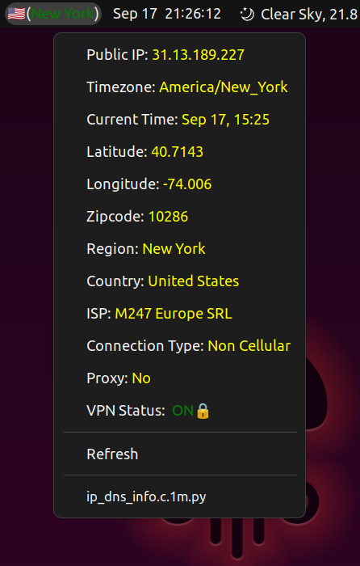

# IP and DNS details

## Argos plugin to Display IP and DNS details in the top bar of GNOME desktop environment.

### Installation

1. Obviously you need python and [Argos](https://github.com/Coda-Coda/argos.git) (recomended for all gnome versions) / [Argos](https://github.com/rammie/argos/tree/gnome-3.36) (gnome-3.36 branch for gnome versions <40)
2. Copy the script to `~/.config/argos/` directory.
3. Make the script executable by running `chmod +x ip_dns_info.c.1m.py`.
4. Refresh GNOME extensions by pressing `Alt+F2` and typing `r` and pressing `Enter`.

### Usage

The script should just display the IP and DNS details in the top bar of GNOME desktop with a Country Flag emoji and the city name. If the city name is in green color, it means your system is connected to a VPN. If the city name is in red color, it means your system is not connected to a VPN. You can click on the city name to see the IP and DNS details in a drop down window. Which shows following details:

1. IP Address
2. Latitude
3. Longitude
4. Zip Code
5. Region(Usually state)
6. Country
7. ISP(Internet Service Provider)
8. Connection Type(Cellular or Non-Cellular)
9. Proxy(Yes or No)
10. VPN Status(ON or OFF)

<!-- screenshot of the plugin which in the center of the screen at 50% width -->

### How to add more info to the top bar?

Go to [IP-API](https://ip-api.com/docs/api:json) website to check what other details you can get from the API. Then update the script accordingly.

### API limitations
There is a limit of 45 requests per minute. If you exceed this limit, you will get blocked for 1 hour. So, please use the script responsibly.

### License
The code is licensed under **Apache License 2.0.** The API does not require any authentication and is free to use for non-commercial use.

### TODO:
- [ ] Fix Refresh in the Dropdown.